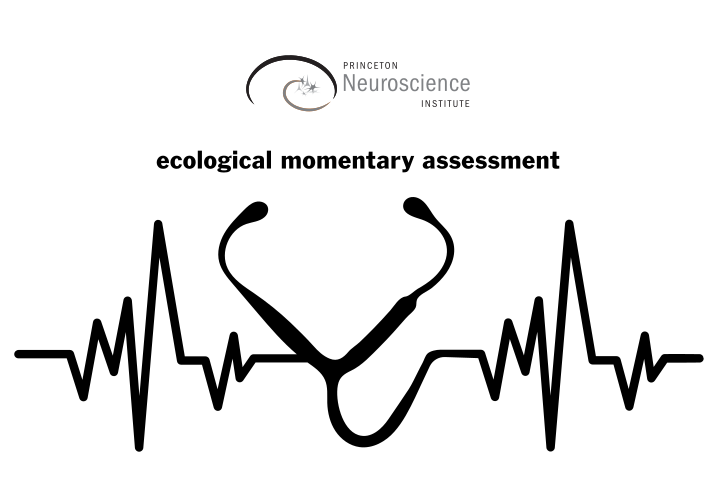

# pni-ema v0.1.1

Climate and Inclusion Ecological momentary assessment for  [Princeton Neuroscience Institute](https://pni.princeton.edu/) employees.

<p align="center">
  
</p>

## Prerequisites

* [Python 3.10](https://www.python.org/downloads/) (and add it to top of PATH)
* [pip](https://pip.pypa.io/en/stable/) (and add it to PATH)
* [git](https://git-scm.com/download/)  (and add it to PATH)

## Installation and updating

Set up a new virtual environment with Python 3.10 and give it any name, _e.g._, venv_name.
```bash
python -m venv venv_name
```
Activate the virtual environment with:
```bash
source ./venv_name/bin/activate
```
or, on OS Windows:
```bash
.\venv_name\Scripts\activate
```
Install the repository with command below. Also, rerun the same command to check for and install updates.
```bash
pip install git+https://github.com/bartulem/pni-ema --use-pep517
```

## Usage

Locate the pip installed package:
```bash
pip show pni-ema
```
Navigate to the directory w/ the "send_ema_email.py" file (example path listed below).
```bash
cd /.../venv_name/lib/site-packages/pni-ema
```
Make sure you define locations of the eml_file, email_config_file and ema_directory at the bottom of send_ema_email.py. Run the script.
```bash
python send_ema_email.py
```

Developed and tested in PyCharm Pro 2023.1.1, on Windows 10/Ubuntu 22.04 LTS.

